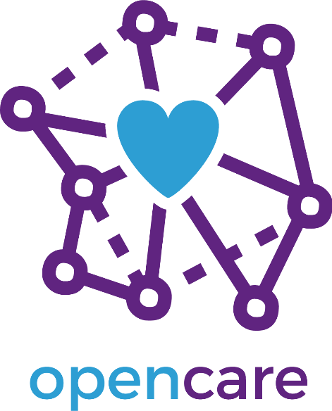

**Deliverable ****3****.****2****: ****Full documentation of all prototypes**

<table>
  <tr>
    <td> </td>
    <td> </td>
    <td> </td>
    <td></td>
    <td></td>
  </tr>
  <tr>
    <td> </td>
    <td>Project Acronym</td>
    <td>OPENCARE</td>
    <td></td>
    <td></td>
  </tr>
  <tr>
    <td> </td>
    <td>Title</td>
    <td>Open Participatory Engagement in Collective Awareness for REdesign of Care services</td>
    <td></td>
    <td></td>
  </tr>
  <tr>
    <td> </td>
    <td>Project Number</td>
    <td>688670</td>
    <td></td>
    <td></td>
  </tr>
  <tr>
    <td> </td>
    <td> </td>
    <td></td>
    <td></td>
    <td></td>
  </tr>
  <tr>
    <td> </td>
    <td>Work package</td>
    <td>WP3 – Prototype community-driven care services</td>
    <td></td>
    <td></td>
  </tr>
  <tr>
    <td> </td>
    <td>Lead Beneficiary</td>
    <td>WeMake srl</td>
    <td></td>
    <td></td>
  </tr>
  <tr>
    <td> </td>
    <td> </td>
    <td> </td>
    <td></td>
    <td> </td>
  </tr>
  <tr>
    <td> </td>
    <td>Editor(s)</td>
    <td>Costantino Bongiorno

Chiara Ferrero</td>
    <td>WeMake srl</td>
    <td></td>
  </tr>
  <tr>
    <td> </td>
    <td>Reviewer(s)</td>
    <td>Laura Romano</td>
    <td>WeMake srl</td>
    <td></td>
  </tr>
  <tr>
    <td> </td>
    <td> </td>
    <td>Matteo Matteini</td>
    <td>Comune di Milano</td>
    <td></td>
  </tr>
  <tr>
    <td> </td>
    <td></td>
    <td> </td>
    <td></td>
    <td></td>
  </tr>
  <tr>
    <td> </td>
    <td>Dissemination Level</td>
    <td>Public</td>
    <td></td>
    <td></td>
  </tr>
  <tr>
    <td> </td>
    <td> </td>
    <td> </td>
    <td></td>
    <td></td>
  </tr>
  <tr>
    <td> </td>
    <td>Contractual Delivery Date</td>
    <td>31/08/2017</td>
    <td></td>
    <td></td>
  </tr>
  <tr>
    <td> </td>
    <td>Actual Delivery Date</td>
    <td>28/12/2017</td>
    <td></td>
    <td></td>
  </tr>
  <tr>
    <td> </td>
    <td>Version</td>
    <td>1.0</td>
    <td></td>
    <td></td>
  </tr>
  <tr>
    <td> </td>
    <td>Status</td>
    <td>Final</td>
    <td></td>
    <td></td>
  </tr>
</table>

Summary

[[TOC]]

# Intro

This document is to be intended as a description of the Deliverable 3.2: Full documentation of all prototypes.

One of the key aims of the Opencare project is to collaboratively develop a how-to guide to document activities in the field or in the lab/makerspace in such a way that documentation can be fed back to the online conversation. 

The full documentation of the prototypes developed is publicly released on Github as repositories of the "organization" opencarecc ([https://github.com/opencarecc](https://github.com/opencarecc)). 

The deliverable 3.2 is composed of source files, auxiliary design files, bill of materials and list of suppliers, software and firmware, multimedia (photos and videos), instructions and explanations. 

Information and updates are related to the actual prototypes developed (stage of implementation, debugging and evaluations, usability testing, executive design review and redesign, engagement of the diverse communities involved). 

All the content above is publicly available as "source code" and contained in  the following **repositories**:

1. **INPE** 

    * [https://github.com/opencarecc/inpe](https://github.com/opencarecc/inpe)

2. **OPEN RAMPETTE **

    * [https://github.com/opencarecc/rampette](https://github.com/opencarecc/rampette)

3. **ALLERGOKI**

    * [https://github.com/opencarecc/allergoki](https://github.com/opencarecc/allergoki)

4. **BREATHING GAMES**

    * [https://github.com/opencarecc/breathinggames](https://github.com/opencarecc/breathinggames)

5. **REHUB** 

    * [https://github.com/opencarecc/rehub](https://github.com/opencarecc/rehub)

6. **VOICE INSTRUMENTS**

    * [https://github.com/opencarecc/voiceinstruments](https://github.com/opencarecc/voiceinstruments)

Prototypes documentation is publicly displayed as collection of **websites** linked from the PROJECTS menu of the opencare landing page [(http://opencare.cc/](http://opencare.cc/)):

1. **INPE**

    * [http://inpe.opencare.cc/](http://inpe.opencare.cc/)

2. **OPEN RAMPETTE**

    * [http://rampette.opencare.cc/](http://rampette.opencare.cc/)

3. **ALLERGOKI**

    * [http://allergoki.opencare.cc/](http://allergoki.opencare.cc/)

4. **BREATHING GAMES**

    * [http://breathinggames.opencare.cc/](http://breathinggames.opencare.cc/)

5. **REHUB **

    * [http://rehub.opencare.cc/](http://rehub.opencare.cc/)

6. **VOICE INSTRUMENTS**

    * [http://voiceinstruments.opencare.cc/](http://voiceinstruments.opencare.cc/)

An additional repository to mention  is **MicroWebsiteTemplate**:

[https://github.com/opencarecc/MicroWebsiteTemplate](https://github.com/opencarecc/MicroWebsiteTemplate) 

A user can find all the code to create a website for documenting an open source project.

WeMake designed the website in order to contain most common documentation elements useful to engage related communities.

All the prototype websites were "forked" from the starting base template.

[https://opencarecc.github.io/MicroWebsiteTemplate](https://opencarecc.github.io/MicroWebsiteTemplate)

The opencare ([http://opencare.cc/](http://opencare.cc/)) website is using the same technical structure  and layout of the prototypes website with a small modification to improve the home page. 

The section [Special Prototype](#heading=h.1f8dyni3vnn1) hosts some screenshots taken from the documentation websites of two "special" prototypes:  INPE and OPEN RAMPETTE. 

These two projects have this "special" status since WeMake community and staff were directly involved in managing the local co-design and development processes. Both prototypes, INPE and OPENRAMPETTE, are part of a wider activity carried out in collaboration with City of Milan. They included an assessment of the community’s needs and the redesigning of the city accessibility policy, rewired in a co-design process after the underperformance of City of Milan's top down attempt taking place in the previous two years. (see Technical Review for details)

[INPE](#heading=h.nmcrqhiptf61) was mainly developed during year 2016, as a result of a cycle of co-design sessions that took place at WeMake, where citizens were invited to describe anonymously - and therefore find a solution - to the obstacles  they had to face on a daily basis and preventing their well-being.

[OPEN RAMPETTE](#heading=h.w1k8tej6jq9g) was developed during year 2017, addressing the problem of accessibility to Milan commercial activities (stores, restaurants, cafès, exc.). It was carried out as a cycle of co-design sessions, together with citizens and shop owners, with a specific focus on two main aspects: the complex regularization procedure for shops’ accessibility and the inefficient temporary ramp call system.

The section [Community Prototype](#heading=h.7xcdqnd8ulph) shows some screenshots displaying the documentation websites of 4 projects that took part in the opencare Maker in Residence (MIR), a special residency programme organized by WeMake  and using WeMake fablab as main location.

Preceded by a Call for Makers, the MIR took place between April and September 2017 and involved 6 different groups of makers (national and international), WeMake staff, WeMake offline community and opencare online community.

During their stay (two weeks long on average) the teams had the opportunity to take part in an intense collaborative environment, exchanging knowledge and expertises in order to improve and accelerate their project.

Among the variety of activities organized during the Maker in Residence, it is possible to list: 

* using digital fabrication tools and methodologies

* practising agile planning methods

* receiving feedbacks from opencare network of experts 

* connecting with local and online creative communities

* participating and organizing dissemination events 

* exploring new business models 

* testing and displaying the prototypes to a proactive audience.

# How we documented the prototypes

The documentation is following the best practices of good documentation in the "maker communities" (see also the section: Sharing documentation how to facilitate replicability of processes and results of the [opencare Maker Playbook](https://makerplaybook.opencare.cc/).)

The documentation is released using a lot of the features available on Github where many of the open source projects are made public and open to collaboration. 

All **websites** are based on Jekyll ( a simple, blog-aware, static site generator for personal, project, or organization sites distributed under an open source license) and GitHub Pages (a static site hosting service by Github). 

This combination of a publishing system and hosting makes it easy to:

* keep project's documentation and actual project files in the same place, the repository, thanks to GitHub Pages

* create and publish a variety of content in an easy-to-use language (markdown) and arrange the site layout to match the project's needs, thanks to Jekyll (see also: [https://github.com/opencarecc/MicroWebsiteTemplate/wiki/](https://github.com/opencarecc/MicroWebsiteTemplate/wiki))

* foster contributions by a wider audience

## CONTENT ARCHITECTURE

Each prototype repository contains: 

1. a **read.me** file

    * contains all the essential information about the project

2. **master** branch

    * contains all source files, auxiliary design files, bills of materials and suppliers, software and firmware

3. **gh-pages** branch

    * contains all the **website** source code and html rendered file

4. **wiki**

    * when istruction or tutorial are useful is possible to activate the wiki section. The wiki is easily readable in a browser and can be also easily edited by collaborators of the project. 

Github has also the possibility to integrate other useful sections as Projects (to manage task and manage the collaborative work) and Issue tracker (to solve bugs or to develop new features)

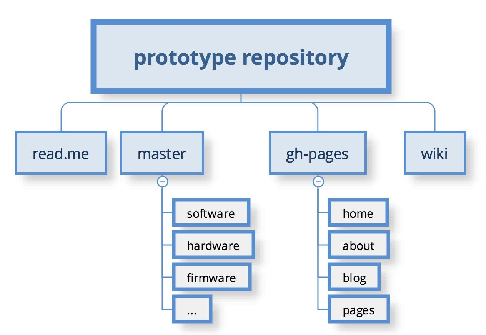

In the following pages some screenshot and information about the sections (home, about, blog/news) and the content about the prototype. 

### HOMEPAGE

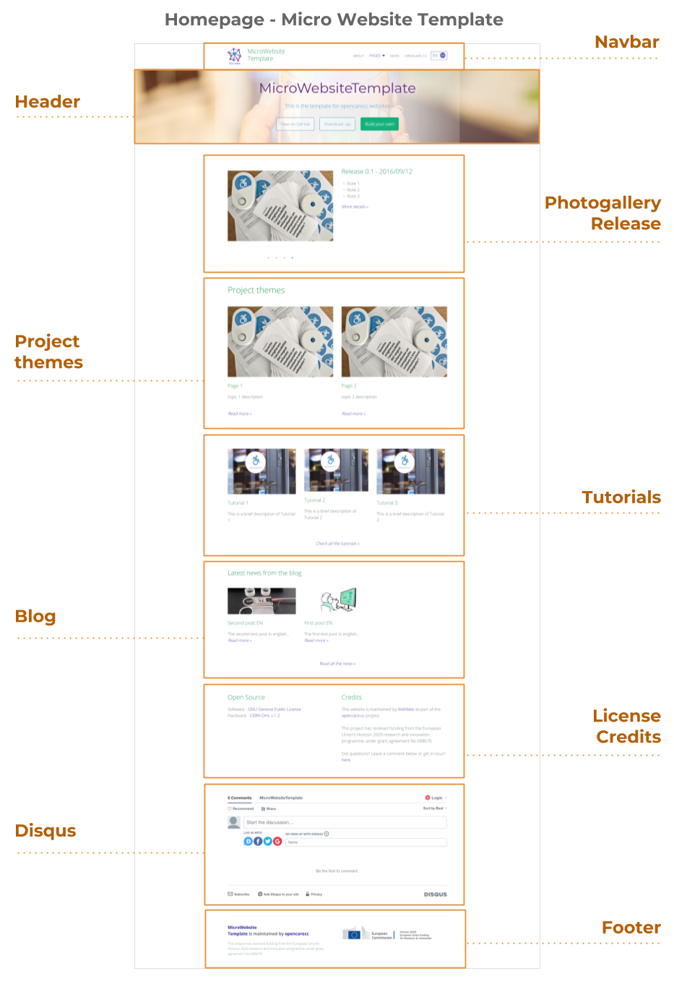

An home page or a start page is the initial or main web page of a website or a browser. The initial page of a website is sometimes called main page as well. A home page is generally the main page a visitor navigating to a website from a web search engine will see, and it may also serve as a landing page to attract visitors. The home page is used to facilitate navigation to other pages on the site by providing links to prioritized and recent articles and pages, and possibly a search box. For example, a news website may present headlines and first paragraphs of top stories, with links to full articles, in a dynamic web page that reflects the popularity and recentness of stories.

References: [https://en.wikipedia.org/wiki/Home_page](https://en.wikipedia.org/wiki/Home_page)

#### HEADER

The header of a webpage typically includes the company or organization's logo, as well as the main navigation bar. This section, which resides at the top of each webpage, is often part of a template and therefore is the same across all pages within a website or section of a website.

It is structured to provide a brief and specific introduction to the project:

* Project Name

* Short description of the project, in a tweet (max 150 characters)

* Three buttons / links to GitHub Repository

* Representative Background Image

References: [https://techterms.com/definition/header](https://techterms.com/definition/header)

#### NAVBAR

A navigation bar (or navigation system) is a section of a graphical user interface intended to aid visitors in accessing information and displaying the name of the project.

References: [https://en.wikipedia.org/wiki/Navigation_bar](https://en.wikipedia.org/wiki/Navigation_bar)

#### PHOTOGALLERY

Often used as a picture carousel, it shows some pictures about the project, the team or other relevant events.

#### RELEASE

When referred to a software, the release life cycle is the sum of the stages of development and maturity for a piece of computer software: ranging from its initial development to its eventual release, and including updated versions of the released version to help improve software or fix software bugs still present in the software.

Here it refers to the state of the art of the project.

References: [https://en.wikipedia.org/wiki/Software_release_life_cycle](https://en.wikipedia.org/wiki/Software_release_life_cycle)

#### PROJECT THEMES

It provides a direct link to possible sub-themes regarding the project, with title and brief description.

#### TUTORIALS

A tutorial is a method of transferring knowledge and may be used as a part of a learning process. More interactive and specific than a book or a lecture, a tutorial seeks to teach by example and supply the information to complete a certain task.

Here it provides a direct link to tutorials, with title and brief description, in order to support other people building or developing the project.

References: [https://en.wikipedia.org/wiki/Tutorial](https://en.wikipedia.org/wiki/Tutorial)

#### BLOG

A blog (a truncation of the expression "weblog") is a discussion or informational website published on the World Wide Web consisting of discrete, often informal diary-style text entries ("posts"). Posts are typically displayed in reverse chronological order, so that the most recent post appears first, at the top of the web page.

In this section it shows the overview of three latest posts, with title and brief description.

References: [https://en.wikipedia.org/wiki/Blog](https://en.wikipedia.org/wiki/Blog)

#### LICENSE

It refers to the permission to use a software on non-exclusive basis, and subject to the listed conditions. A software license does not automatically transfer the ownership of the software to the buyer and its purchase price, in effect, is a one time rental fee. 

In this section it displays pecifications about the license of the Project.

References: [http://www.businessdictionary.com/definition/software-license.html](http://www.businessdictionary.com/definition/software-license.html)

#### CREDITS

Section with information about who is maintaining and/or funding the project.

#### DISQUS

Disqus (pronounced discuss) is a worldwide blog comment hosting service for web sites and online communities that use a networked platform. The company's platform includes various features, such as social integration, social networking, user profiles, spam and moderation tools, analytics, email notifications, and mobile commenting. 

Section where visitors can leave a comment about the project or start / join a conversation.

#### FOOTER

The bottom section of a webpage is also known as a footer. This area typically contains the name of the company or organization that publishes the website, along with relevant copyright information. Some websites may also include basic navigation links, such as "About Us," "Contact," and "Help." Corporate website footers often include additional links to "Terms of Use," "Privacy Guidelines," and "Advertising" pages as well.

Here it shows the name of the company or organization that publishes the website, along with relevant copyright information.

References: [https://techterms.com/definition/footer](https://techterms.com/definition/footer)

### PAGES

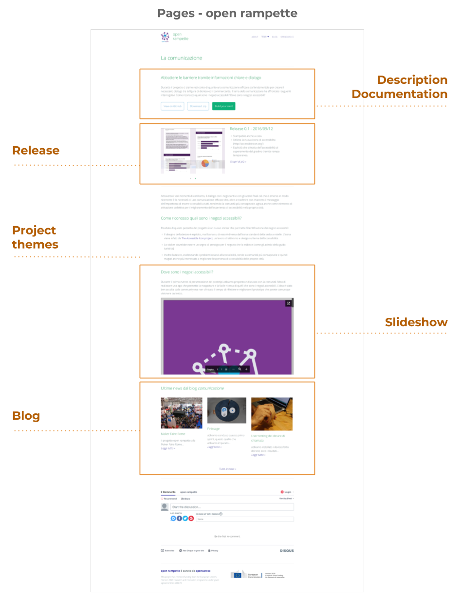

They can be dedicated to specific topics, such as different areas or characteristics of the same project, or different projects.

References: [https://techterms.com/definition/webpage](https://techterms.com/definition/webpage)

#### DESCRIPTION and DOCUMENTATION

Description of the sub-topic, where applicable, with direct link / buttons to GitHub or equivalent repository.

#### RELEASE

State of the art of the project or of the sub-theme.

#### SLIDESHOW

Embedded presentation about activities’ outcomes or prototypes.

#### BLOG

Latest news about the specific theme of the page; it shows the overview of three posts, with title and brief description.

### ABOUT

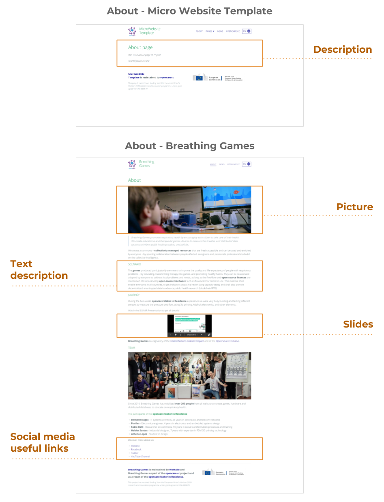

This page presents the original information about the Project. It may be composed by a representative image of the Project, a brief description, a description about the project development and an introduction of the team members especially of whom participated in the project. 

#### DESCRIPTION

Description of the project and, potentially, of the team.

The information provided depends on the project itself (see example below). It usually includes:

* Details about project - scenario - journey - team

* Pictures

* Videos

* Slideshows

* ...

#### PICTURE

One or more images representing the project; design or development phases and/or the team.

#### TEXT DESCRIPTION

Detailed description that allows visitors to have a complete overview of the project.

#### SLIDES

Embedded presentation about activities’ outcomes or prototypes.

#### SOCIAL MEDIA AND LINKS

Any useful link that could provide further information.

### BLOG

### 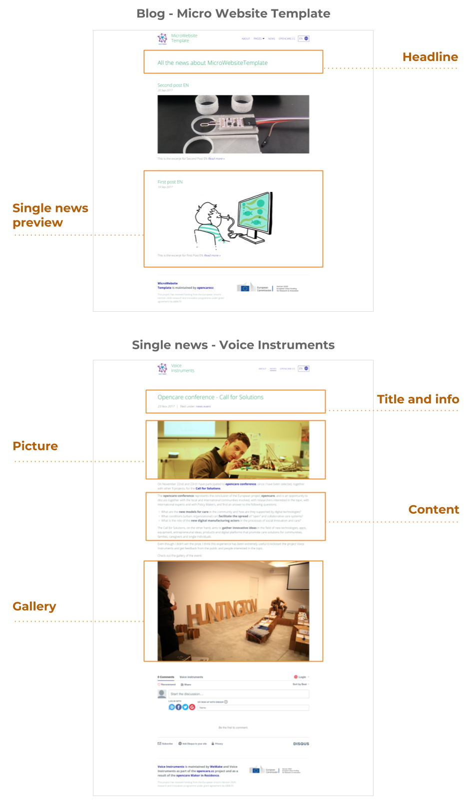

A blog (a truncation of the expression "weblog") is a discussion or informational website published on the World Wide Web consisting of discrete, often informal diary-style text entries ("posts"). Posts are typically displayed in reverse chronological order, so that the most recent post appears first, at the top of the web page.

#### HEADLINE

Description of the section, with latest News referred to the project.

#### SINGLE NEWS PREVIEW

Title, date,  picture, short excerpt and link.

#### TITLE and INFO

News title, publication date and related tags.

#### PICTURE

Image related to the content of the news.

#### CONTENT

Information concerning the news, that could have different characteristics: storytelling, save the date, update, exc.

#### GALLERY

Embedded photogallery (example: Flickr).

# Special prototypes

The section [Special Prototype](#heading=h.1f8dyni3vnn1) hosts some screenshots taken from the documentation websites of two "special" prototypes:  INPE and OPEN RAMPETTE. 

This two projects are "special" meaning that WeMake community and staff were directly involved in managing the local co-design and development processes. Both prototypes, INPE and OPENRAMPETTE, are part of a wider activity carried out in collaboration with City of Milan. It included an assessment of the community’s needs and the redesigning of accessibility’s public policy, rewired in a co-design process after the underperformance of City of Milan's top down attempt taking place in the previous two years. (see Technical Review for details)

[INPE](#heading=h.nmcrqhiptf61) was mainly developed during year 2016, as a result of a cycle of co-design sessions that took place at WeMake, where citizens were invited to describe anonymously - and therefore find a solution - to the obstacles  they had to face on a daily basis and preventing their well-being.

[OPEN RAMPETTE](#heading=h.w1k8tej6jq9g) was developed during year 2017, addressing the problem of accessibility to Milanese commercial activities (stores, restaurants, cafès, exc.). It was carried out as a cycle of co-design sessions, together with citizens and shop owners, with a specific focus on two main aspects: the complex regularization procedure for shops’ accessibility and the inefficient temporary ramp call system.

## INPE

#### HOME

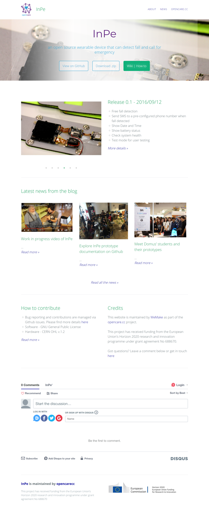

#### ABOUT

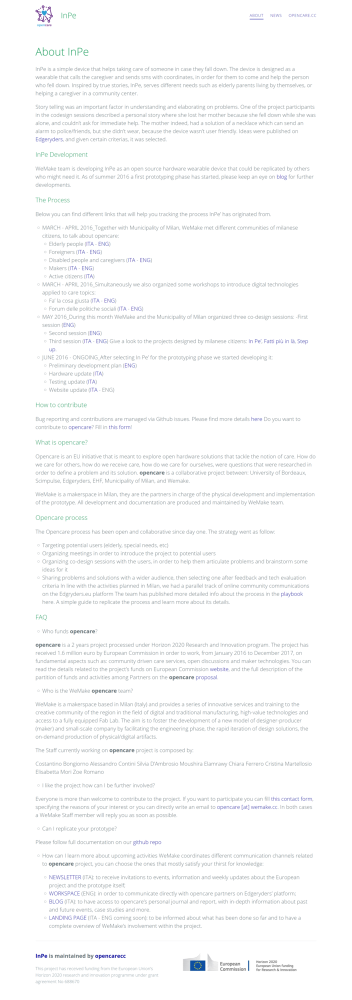

#### BLOG

## 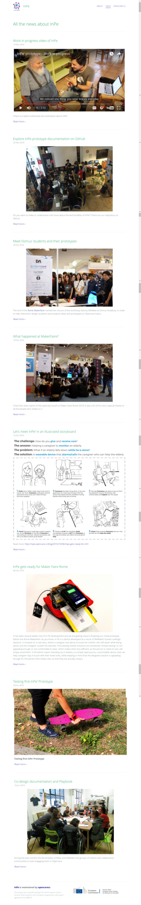

## OPEN RAMPETTE

#### HOME

#### 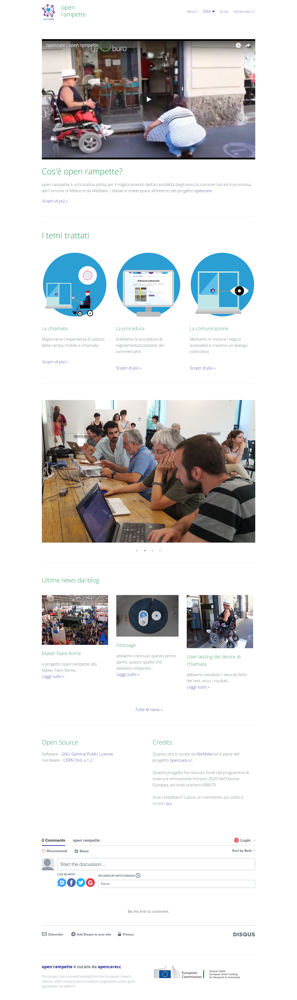

#### ABOUT

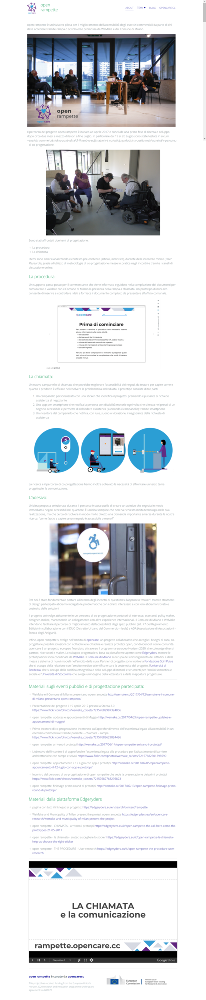

#### BLOG

####  (NOTE:  http://rampette.opencare.cc/blog/)

# Community prototype

In the section [Community Prototype](#heading=h.7xcdqnd8ulph) some screenshots displaying the documentation websites of 4 projects that took part in the opencare Maker in Residence (MIR), a special residency programme organized by and at WeMake.

Preceded by a Call for Makers, the MIR took place between April and September 2017 and involved 6 different groups of makers (national and international), WeMake staff, WeMake offline community and opencare online community.

During their stay (two weeks long on average) the teams had the opportunity to take part in an intense collaborative environment, exchanging knowledge and expertises in order to improve their project.

Among the variety of activities organized within the Maker in Residence, it is possible to list: using digital fabrication tools and methodologies, practising agile planning methods, receiving feedbacks from experts, connecting with creative communities, participating and organizing events, experimenting new business models, testing and displaying the prototypes to a proactive audience.

### ALLERGOKI

#### HOME

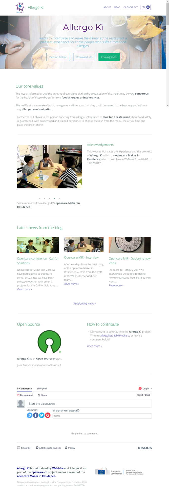

#### ABOUT

#### 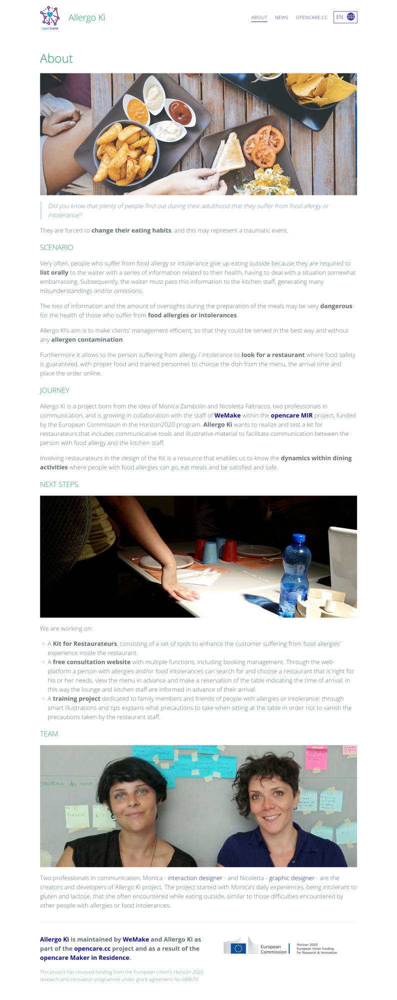

#### BLOG

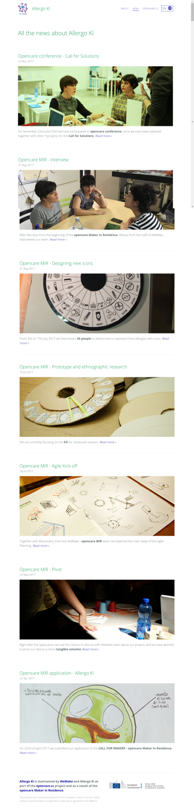

### BREATHING GAMES

#### HOME

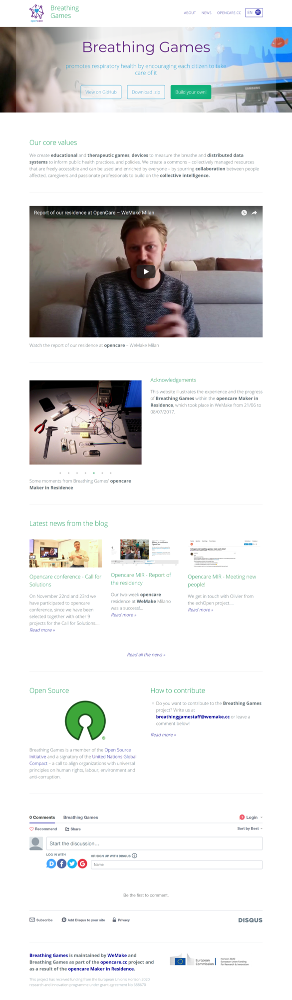

#### ABOUT

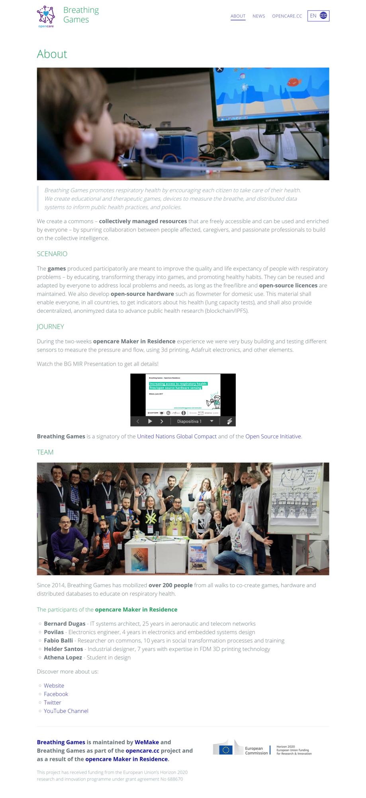

#### BLOG

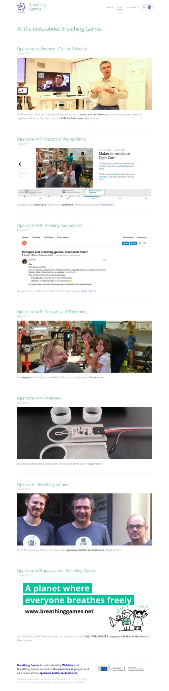

### REHUB 

#### HOME

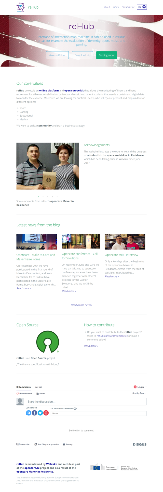

#### ABOUT

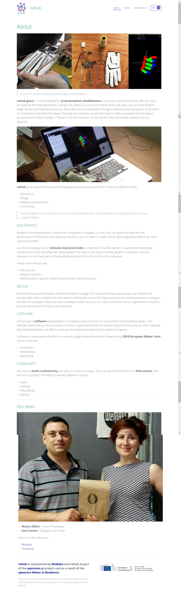

#### BLOG

### 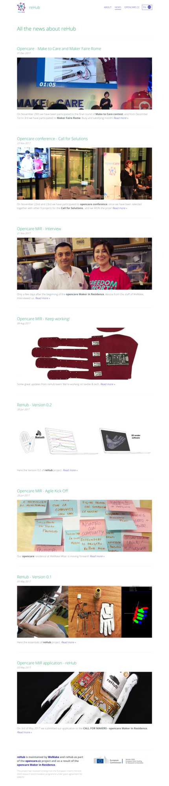

### VOICE INSTRUMENTS

#### HOME

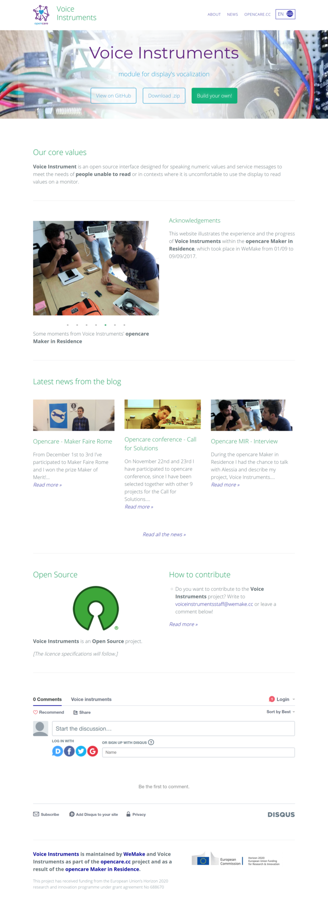

#### ABOUT

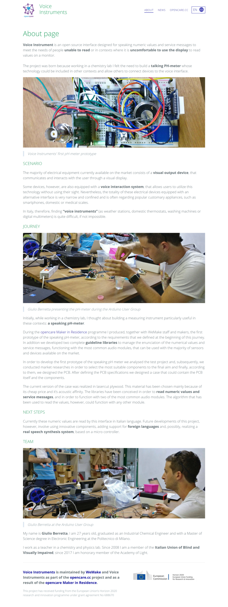

#### BLOG

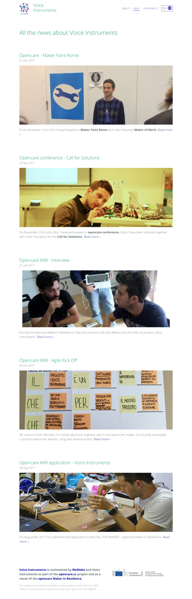

