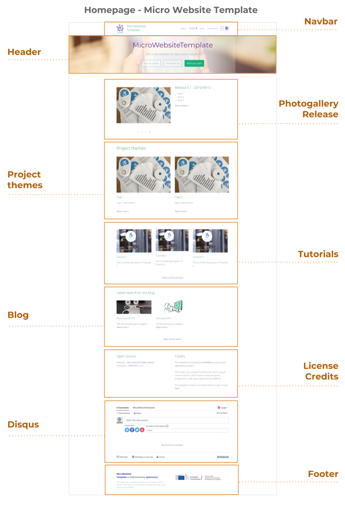

### HOMEPAGE

An home page or a start page is the initial or main web page of a website or a browser. The initial page of a website is sometimes called main page as well. A home page is generally the main page a visitor navigating to a website from a web search engine will see, and it may also serve as a landing page to attract visitors. The home page is used to facilitate navigation to other pages on the site by providing links to prioritized and recent articles and pages, and possibly a search box. For example, a news website may present headlines and first paragraphs of top stories, with links to full articles, in a dynamic web page that reflects the popularity and recentness of stories.

References: [https://en.wikipedia.org/wiki/Home_page](https://en.wikipedia.org/wiki/Home_page)

#### HEADER

The header of a webpage typically includes the company or organization's logo, as well as the main navigation bar. This section, which resides at the top of each webpage, is often part of a template and therefore is the same across all pages within a website or section of a website.

It is structured to provide a brief and specific introduction to the project:

* Project Name

* Short description of the project, in a tweet (max 150 characters)

* Three buttons / links to GitHub Repository

* Representative Background Image

References: [https://techterms.com/definition/header](https://techterms.com/definition/header)

#### NAVBAR

A navigation bar (or navigation system) is a section of a graphical user interface intended to aid visitors in accessing information and displaying the name of the project.

References: [https://en.wikipedia.org/wiki/Navigation_bar](https://en.wikipedia.org/wiki/Navigation_bar)

#### PHOTOGALLERY

Often used as a picture carousel, it shows some pictures about the project, the team or other relevant events.

#### RELEASE

When referred to a software, the release life cycle is the sum of the stages of development and maturity for a piece of computer software: ranging from its initial development to its eventual release, and including updated versions of the released version to help improve software or fix software bugs still present in the software.

Here it refers to the state of the art of the project.

References: [https://en.wikipedia.org/wiki/Software_release_life_cycle](https://en.wikipedia.org/wiki/Software_release_life_cycle)

#### PROJECT THEMES

It provides a direct link to possible sub-themes regarding the project, with title and brief description.

#### TUTORIALS

A tutorial is a method of transferring knowledge and may be used as a part of a learning process. More interactive and specific than a book or a lecture, a tutorial seeks to teach by example and supply the information to complete a certain task.

Here it provides a direct link to tutorials, with title and brief description, in order to support other people building or developing the project.

References: [https://en.wikipedia.org/wiki/Tutorial](https://en.wikipedia.org/wiki/Tutorial)

#### BLOG

A blog (a truncation of the expression "weblog") is a discussion or informational website published on the World Wide Web consisting of discrete, often informal diary-style text entries ("posts"). Posts are typically displayed in reverse chronological order, so that the most recent post appears first, at the top of the web page.

In this section it shows the overview of three latest posts, with title and brief description.

References: [https://en.wikipedia.org/wiki/Blog](https://en.wikipedia.org/wiki/Blog)

#### LICENSE

It refers to the permission to use a software on non-exclusive basis, and subject to the listed conditions. A software license does not automatically transfer the ownership of the software to the buyer and its purchase price, in effect, is a one time rental fee.

In this section it displays pecifications about the license of the Project.

References: [http://www.businessdictionary.com/definition/software-license.html](http://www.businessdictionary.com/definition/software-license.html)

#### CREDITS

Section with information about who is maintaining and/or funding the project.

#### DISQUS

Disqus (pronounced discuss) is a worldwide blog comment hosting service for web sites and online communities that use a networked platform. The company's platform includes various features, such as social integration, social networking, user profiles, spam and moderation tools, analytics, email notifications, and mobile commenting.

Section where visitors can leave a comment about the project or start / join a conversation.

#### FOOTER

The bottom section of a webpage is also known as a footer. This area typically contains the name of the company or organization that publishes the website, along with relevant copyright information. Some websites may also include basic navigation links, such as "About Us," "Contact," and "Help." Corporate website footers often include additional links to "Terms of Use," "Privacy Guidelines," and "Advertising" pages as well.

Here it shows the name of the company or organization that publishes the website, along with relevant copyright information.

References: [https://techterms.com/definition/footer](https://techterms.com/definition/footer)